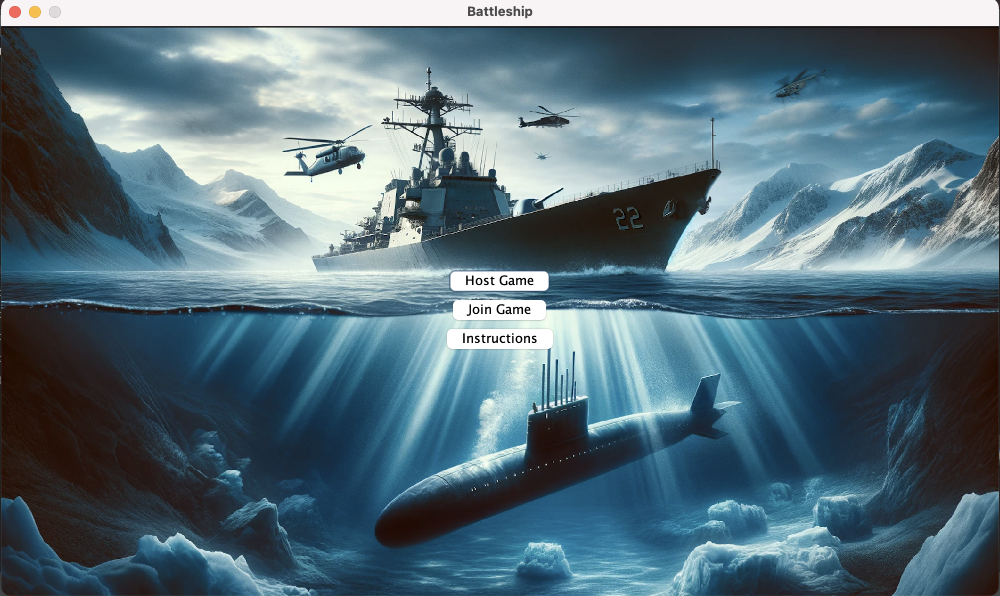
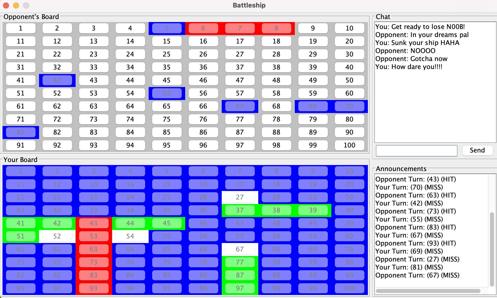

# Battleship

Author: Omer Faruk Basar

Final project for Intro to Java

Due: May 10, 2024

# Rules

This is a 2 player game that is meant to be hosted over a local network.
Do not attempt to launch 2 instances on the same machine, it will not work.
This game should be played on 2 separate computers. 
One person will host the game, and the other will join the host's game.

With the current implementation, the host is the one who goes first.

When it is a user's turn, they must click a coordinate to attack on the opponent's board.
Successful attacks are colored in red while misses are marked in blue. On the player's board their ships are randomly assigned and marked in green. When the player's ship is hit, its marked in red and misses are marked in white.

After each attack, the selected coordinate is disabled to prevent duplicate launches. The overall objective is to sink all the opponent's ships.
The game ends whenever someone runs out of ships. The game also ends if someone disconnects during the match.

Users can chat with each other using the chat panel if they wish.
Moves made by players are shown in the announcement panel.

# Screenshots

# Future possible additions:

Randomized first turn

Sound effects

Single player mode

More optimizations

